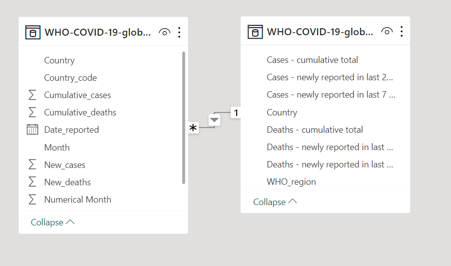
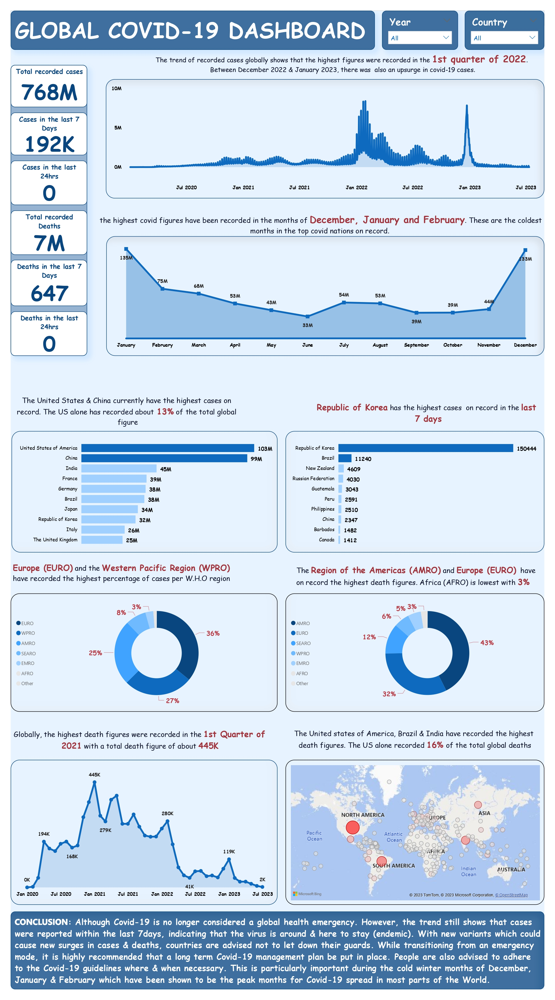

# GLOBAL-COVID-I9

## Introduction
This project was mandated by Quantum Analytics NG as part of my internship. The instruction was to carry out a live analysis of COVID-19 dataset from the World Health Organisation (WHO) website for an update on COVID-19 events. Power BI was the visualization tool used in this project and the details are presented below. 

## Problem Statement
The idea behind this project was to get an up-to-date rundown of active and live events regarding Covid-19. Others include:

- Find out what the trend has been like overtime
- Know the worst hit Nations and how they fared
- To know which time of the year records the highest virus spread
- Develop a containment model or plan to cope with the virus going forward.

## Data Sourcing
To access the data needed for this project,  I summarily went to the WHO website which you can find [here](https://covid19.who.int/).
I imported the web link to my Power BI desktop web-link page; selected the relevant tables to the project and loaded it to the Power Query Editor for transformation and cleaning in order to ensure data quality. The dataset is a combination of two tables.  Table-1 has 8-columns with 237rows while the second table has 11 columns with 305,019 rows.

## Data Transformation/Cleaning
The following steps were taken to ensure quality:

- Profiling based on entire dataset
- Removed duplicates
- Replaced empty cells for cases and death records with zero (0)
- Created new columns from the  "Date reported" column. These columns are the "Year", "Month" and "Numerical Month".
- Checked and ensured data types were matching and corresponding

## Data Modelling
Having Tansformed and claeaned the data, I proceeded to close and apply the changes on Power BI, from whence I went to the model view. Although there were 2 tables. However, only one major relationship was spotted between the tables, which is the "country". A view of the model can be seen below:

## Visualization
After the necessary transformation/cleaning and Modelling, the data was considered fit for visualization and insights were generated using key KPI metrics. Below is the single page dashboard generated for this project:

## Conclusion & Recommendation
The project was able to identify the trend of cases, with peak figures recorded in the 1st Quarter of 2022. The World Health Organisation no longer considers the virus a Public Health Emergency of International Concern (PHEIC). However, the trend of events shows that cases were reported in the last 7 days; indicating that the virus is endemic. Despite relaxing stringent Covid-19 measures, various Governments are advised to put in place various containment and coping measures in the event of a future upsurge in covid-19 cases. People are also advised to adhere to the covid-19 guidelines especially during cold-winter months since more cases are usually recorded during that period of the year.

